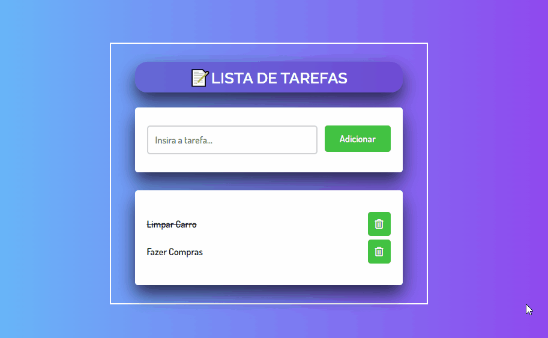

<h1 align="center">📝 Lista de Tarefas ✔️</h1>

Projeto de um gerador de tarefas. A página consiste em  adicionar, checar ou excluir tarefas.

 
 <h2>🕹️ Tecnologias Utilizadas</h2>
    <ul align="center">
        
        
        
    </ul> 

<h2 align="center">🤔 Como Utilizar</h2>

Inserir a tarefa desejada no campo, depois clique em adicionar. As tarefas listadas podem ser riscadas ou excluídas. Abaixo temos um pequeno gif com a apresentação do sistema:
 

Gif - funcionalidades do sistema

<h2 align="center">🔗 Link da página</h2>

Abaixo temos o link da página para visualização e testes:

<a href="https://oseiasweb.github.io/lista-de-tarefas/" target="_blank" class="linkedin">Lista de Tarefas</a> 

 
<h2 align="center">*** Status Projeto ***</h2>

